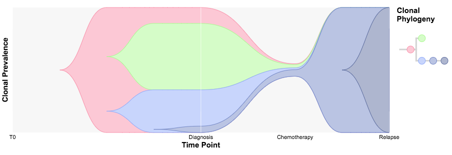

TimeScape is a visualization tool for temporal clonal evolution.

To run TimeScape, type the following commands in R:

```{r, eval=FALSE}
# try http:// if https:// URLs are not supported
source("https://bioconductor.org/biocLite.R")
biocLite("timescape")
```

And the following visualizations will appear in your browser (optimized for Chrome):

The first visualization is of the acute myeloid leukemia patient from Ding et al., 2012:



The second visualization is of the metastatic ovarian cancer patient 7 from McPherson and Roth et al., 2016:


To view the documentation for TimeScape, type the following command in R:

```{r, eval=FALSE}
?timescape 
```

or:

```{r, eval=FALSE}
browseVignettes("timescape") 
```


TimeScape was developed at the Shah Lab for Computational Cancer Biology at the BC Cancer Research Centre.

References:

Ding, Li, et al. "Clonal evolution in relapsed acute myeloid leukaemia revealed by whole-genome sequencing." Nature 481.7382 (2012): 506-510.

McPherson, Andrew, et al. "Divergent modes of clonal spread and intraperitoneal mixing in high-grade serous ovarian cancer." Nature genetics (2016).