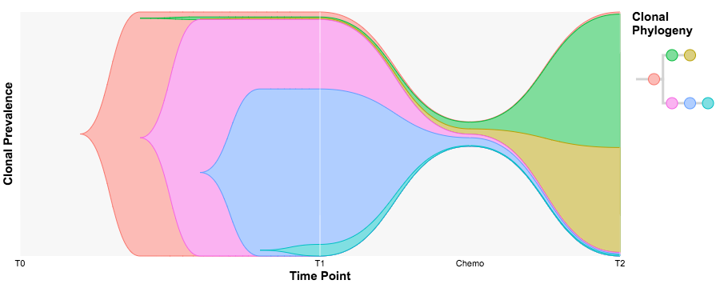

TimeScape is a visualization tool for temporal clonal evolution.

To run TimeScape, type the following commands in R:

install.packages("devtools") # if not already installed  
library(devtools)  
install_bitbucket("MO_BCCRC/timescape")  
library(timescape)  
example(timescape) # to run examples

And the following visualization will appear in your browser (optimized for Chrome):

TimeScape was developed at the Shah Lab for Computational Cancer Biology at the BC Cancer Research Centre.
